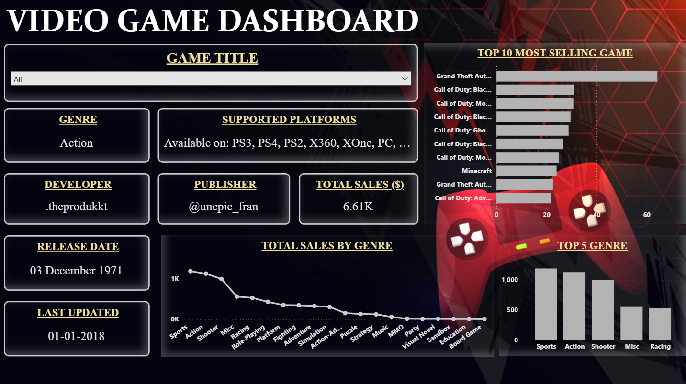

# 🎮 Video Game Sales Dashboard (Power BI)

## 📌 Overview  
This project presents an interactive Video Game Sales Dashboard built using Power BI.  
The dashboard provides insights into game sales, genre popularity, and platform distribution, helping users explore trends in the gaming industry.

---

## 🚀 Key Features  

- 📊 Total Sales Analysis  
  Dynamic DAX measure to calculate overall sales performance.

- 🏆 Top 10 Most Selling Games  
  Identifies the highest-selling video games with a clear comparison.

- 🎯 Genre-wise Sales Insights  
  Breakdown of total sales across different genres.

- 🔝 Top 5 Genres  
  Highlights the most popular and revenue-generating categories.

- 🎮 Supported Platforms Analysis  
  Custom DAX measure showing how many platforms a game is available on.

- 🔍 Interactive Filtering  
  Users can filter by game title to view:
  - Genre  
  - Developer  
  - Publisher  
  - Release Date  
  - Supported Platforms  
  - Total Sales  

---

## 🛠️ Tools & Technologies  

- Power BI  
- DAX (Data Analysis Expressions)  
- Data Modeling  

---

## 📈 Key Insights  

- Action and Sports genres dominate total sales.  
- A small number of top games contribute heavily to overall revenue.  
- Multi-platform games tend to achieve higher reach and sales.  

---

## 📂 Dataset  

Source: Maven Analytics  

The dataset includes:
- Game Titles  
- Genres  
- Platforms  
- Developers & Publishers  
- Sales Data  

---

## 💡 Learning Outcomes  

- Improved DAX measure creation  
- Better understanding of data visualization  
- Enhanced dashboard design skills  
- Learned how to convert raw data into meaningful insights  

---

## 📸 Dashboard Preview  

---

## 🤝 Feedback  

I am continuously improving my data analysis and visualization skills.  
Feel free to share your feedback or suggestions!

---

## 📬 Connect with Me  

Let’s connect on LinkedIn and grow together in the data field!

---

⭐ If you found this project useful, don’t forget to star the repository!
